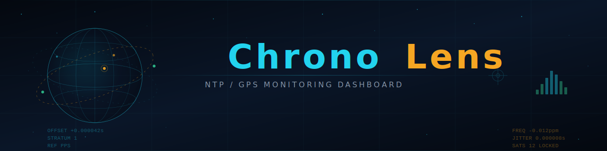
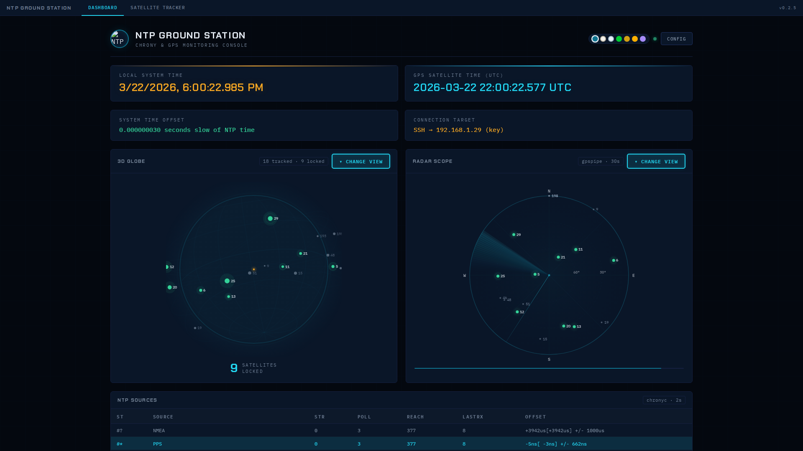
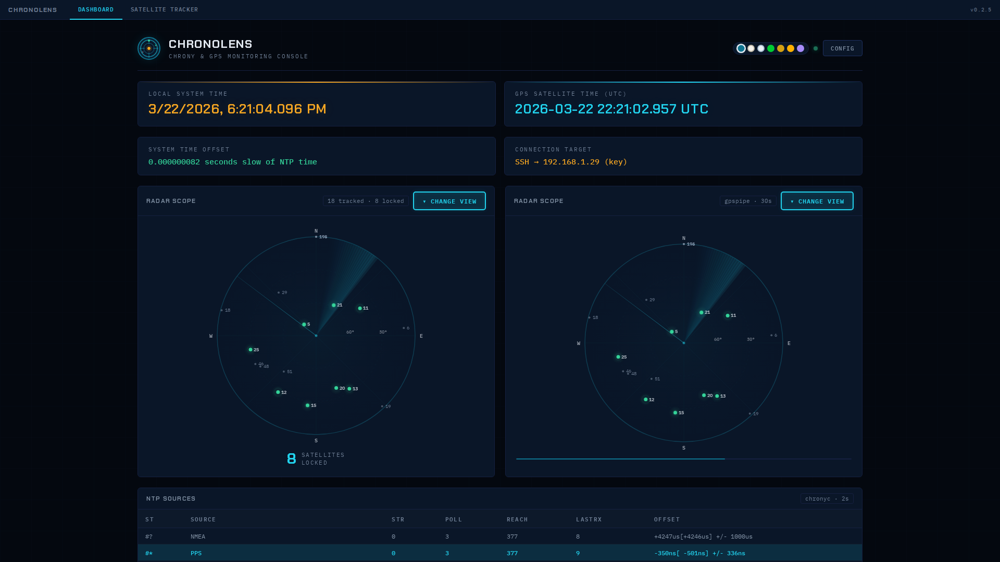
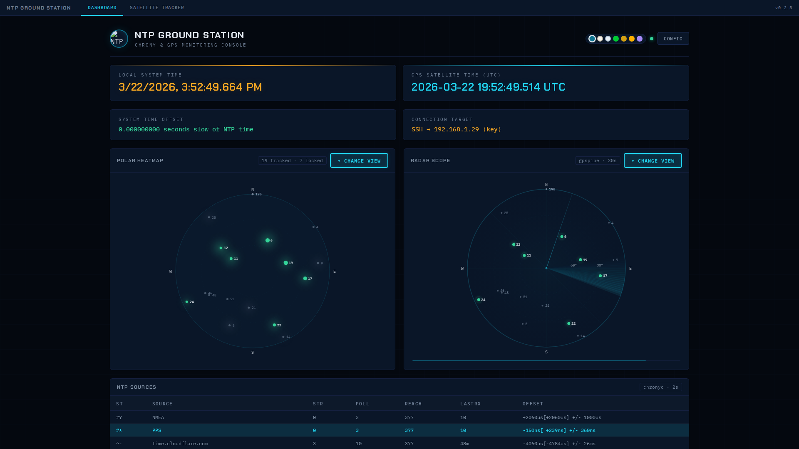
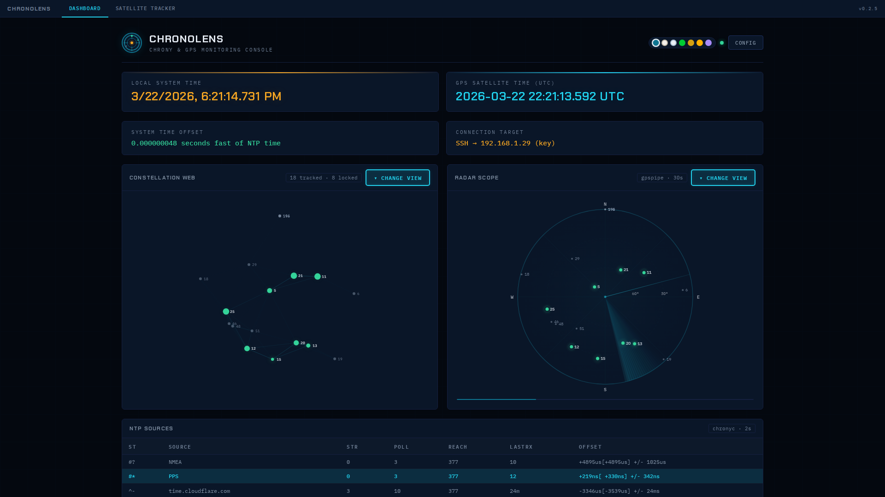
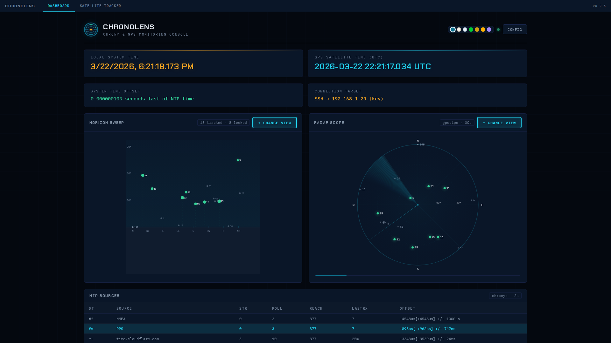
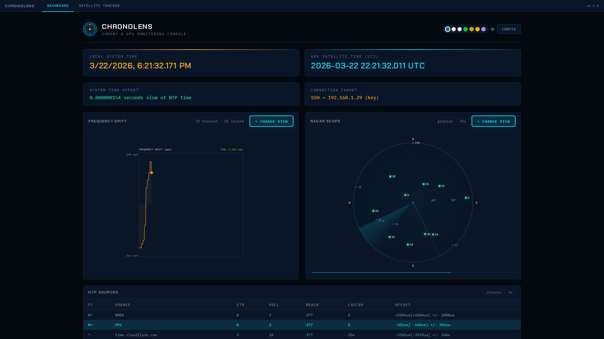
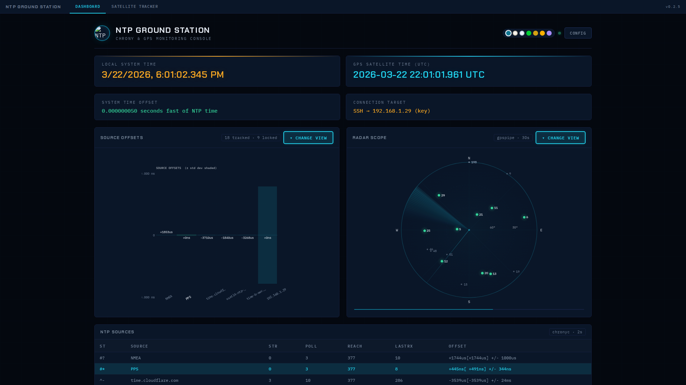
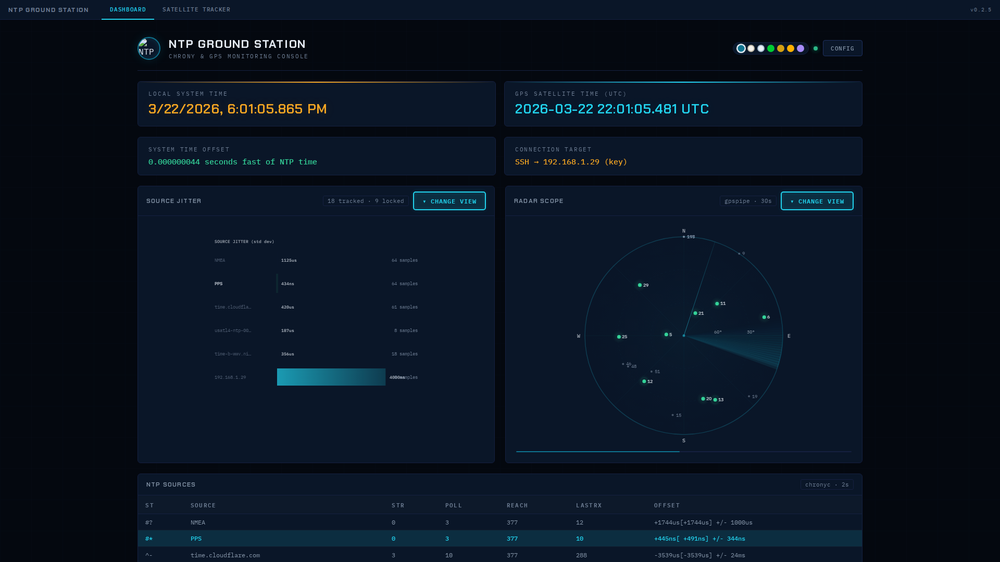
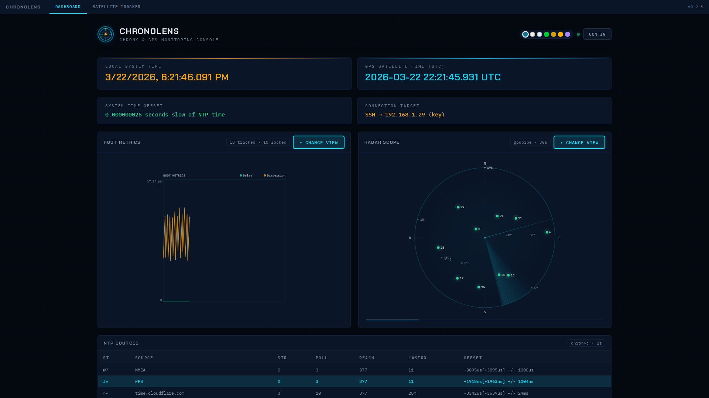

<p align="center">
  
</p>

A lightweight, real-time NTP/GPS monitoring dashboard with a full 3D satellite tracker. Packaged as a sub-100MB Docker container, it connects to a remote chrony/gpsd host over SSH (key-based supported) and delivers a browser UI with 16 live visualizations. It resolves key limitations in the original project and continues to improve geographic accuracy within the real-world constraints of satellite visibility and orbital scale.

   

> **Based on [ntp-dashboard](https://github.com/NightHawkATL/ntp-dashboard) by [NightHawkATL](https://github.com/NightHawkATL).**  

---

## Screenshots

### Dashboard


### Satellite Tracker


### Themes
| Ground Station | Daylight | Phosphor |
|:-:|:-:|:-:|
|  |  |  |

| Solar | Arctic | Amber Terminal |
|:-:|:-:|:-:|
|  |  |  |

| Deep Space |
|:-:|
|  |

### Visualizations (GPS)
| 3D Globe | Radar Scope | Signal Skyline |
|:-:|:-:|:-:|
|  |  |  |

| Polar Heatmap | Constellation Web | Horizon Sweep |
|:-:|:-:|:-:|
|  |  |  |

### Visualizations (NTP/Chrony)
| Chrony Dashboard | Offset Timeline | Frequency Drift |
|:-:|:-:|:-:|
|  |  |  |

| Source Offsets | Source Jitter | Reach Pattern |
|:-:|:-:|:-:|
|  |  |  |

| Root Metrics | Stratum Tree |
|:-:|:-:|
|  |  |

---

## Features

### Main Dashboard (`/`)
- **16 visualization modes** across two side-by-side canvas panels with a modal picker
- **7 GPS visualizations** — 3D wireframe globe, polar radar scope, signal skyline (SNR bars), polar heatmap, constellation web, horizon sweep, signal radar (spider chart)
- **8 NTP/chrony visualizations** — drift timeline, chrony dashboard (12-metric grid), source offset comparison, frequency drift, source jitter, reach pattern, root metrics, stratum tree
- **COBE planet Earth** — WebGL globe with theme-aware colors and real satellite markers (loaded from CDN)
- **7 themes** — Ground Station, Daylight, Phosphor, Solar, Arctic, Amber Terminal, Deep Space
- **Auto-cycle** — rotates through visualizations with smooth fade transitions
- **Live data** — chrony tracking/sources/sourcestats polled every 2s, GPS via gpspipe every 30s
- **Settings modal** — configure target host, SSH auth, Cesium token, receiver coordinates

### Satellite Tracker (`/satellite`)
- **CesiumJS 3D globe** — photorealistic Earth with terrain, atmosphere, and day/night lighting
- **Real GPS constellation** — all operational GPS satellites plotted from CelesTrak TLE data
- **Live receiver overlay** — satellites your receiver can see are highlighted, locked sats glow green
- **Orbital paths** — 12-hour predicted orbit lines for visible satellites
- **Navigation disk** — on-screen D-pad for pan/zoom/home (hold to continuous move)
- **Mobile ready** — full Android/iPhone support with touch gestures, responsive layout, collapsible info panel
- **Street-level zoom** — zoom from orbital view all the way down to individual buildings
- **Self-hosted assets** — CesiumJS and satellite.js bundled in the Docker image (no CDN dependency at runtime)

---

## Quick Start

### 1. Clone and deploy

```bash
git clone https://github.com/danktankk/ChronoLens.git
cd ChronoLens
```

### 2. Add your SSH key

Place your private key (for connecting to the chrony/gpsd host) in the `ssh/` directory:

```bash
mkdir -p ssh
cp ~/.ssh/id_ed25519 ssh/
chmod 600 ssh/id_ed25519
```

### 3. (Optional) Set Cesium token for satellite tracker

The satellite tracker requires a free [Cesium Ion](https://ion.cesium.com/) access token. You can set it via environment variable or through the Settings modal in the UI.

**Option A — Environment variable:**

Add to `compose.yaml` under the service:

```yaml
environment:
  - CESIUM_TOKEN=your_token_here
```

**Option B — Settings modal:**

Launch the dashboard, click the gear icon, and paste your token in the Cesium Ion Access Token field. It will be encrypted and stored in `data/config.json`.

To get a token:
1. Create a free account at [cesium.com/ion](https://cesium.com/ion/)
2. Go to **Access Tokens** in your dashboard
3. Copy the **Default Token** (or create a new one)

### 4. Start

```bash
docker compose up -d --build
```

Dashboard will be available at `http://<your-host>:55234`

---

## Configuration

On first launch, open the **Settings** modal (gear icon on the dashboard) to configure:

| Setting | Description |
|---|---|
| **Target Mode** | `Local` (chrony/gpsd on same host) or `Remote` (SSH to another host) |
| **SSH Host** | IP or hostname of the chrony/gpsd server |
| **SSH User** | Username for SSH connection |
| **Auth Method** | `SSH Key` (mounted in `ssh/`) or `Password` |
| **Cesium Token** | Cesium Ion access token for the satellite tracker |
| **Receiver Lat/Lon** | GPS receiver coordinates (auto-detected from gpsd if available) |

All settings are encrypted and persisted in `data/config.json`.

---

## Using the Dashboard

### Visualization Panels

The two canvas panels on the main dashboard each show one visualization. Click **CHANGE VIEW** on either panel to open the picker.

**GPS visualizations** use data from `gpspipe` — satellite positions, signal strength, lock status. These update every 30 seconds.

**NTP visualizations** use data from `chronyc` — system offset, frequency drift, source statistics, stratum info. These update every 2 seconds.

**Themes** can be switched using the color swatches in the top bar. All visualizations and the COBE planet globe adapt to the selected theme.

### Satellite Tracker

Navigate to the **Satellite Tracker** tab or visit `/satellite` directly.

**Desktop controls:**
- Left-drag to rotate the globe
- Scroll to zoom
- Right-drag to tilt
- Click any satellite for details

**Mobile controls:**
- One-finger drag to rotate
- Pinch to zoom
- Two-finger drag to tilt
- Tap a satellite for details

**Navigation disk (bottom-right):**
- Arrow buttons — pan (hold to keep moving)
- `+` / `-` — zoom in/out
- Center button — fly home to receiver

**What the colors mean:**
- **Green** — satellite locked, actively used for timing
- **Grey** — satellite visible to receiver but not in use
- **Dark** — satellite in constellation but below horizon
- **Amber dot with ring** — your GPS receiver location

---

## Architecture

```
Browser ──────► Flask (port 55234)
                  │
                  ├── / ──────────► index.html + dashboard.js + visualizations.js
                  ├── /satellite ──► satellite.html (CesiumJS + satellite.js)
                  ├── /api/ntp ───► SSH → chronyc tracking/sources/sourcestats
                  ├── /api/gps ───► SSH → gpspipe -w -n 12
                  └── /api/config ► data/config.json (encrypted)
```

- **Frontend**: Vanilla JS, no framework. Canvas-based visualizations via `VizEngine` IIFE module.
- **Backend**: Flask + Paramiko (SSH). Polls remote chrony/gpsd host.
- **CesiumJS**: Self-hosted in Docker image (~5MB JS). Satellite positions computed client-side from TLE data using satellite.js.
- **Data persistence**: `data/` volume stores encrypted config and encryption key.

---

## Docker Volumes

| Path | Purpose |
|---|---|
| `./data:/app/data` | Config file + encryption key (persisted across rebuilds) |
| `./ssh:/app/ssh:ro` | SSH private key for remote chrony/gpsd host |

---

## Requirements

- Docker + Docker Compose
- A chrony + gpsd host (local or remote via SSH)
- A browser with WebGL support (any modern browser)
- (Optional) Free Cesium Ion account for satellite tracker

---


## License

This project is licensed under the **GNU Affero General Public License v3.0** (AGPL-3.0).

This means:
- You can use, modify, and distribute this software freely
- Any modifications must be released under the same license
- **Network use counts as distribution** — if you deploy this as a service (SaaS, hosted dashboard, etc.), you must release your source code

See [LICENSE](LICENSE) for the full text.
