# ChronoLens

A real-time NTP/GPS monitoring dashboard with a full 3D satellite tracker. Runs as a single Docker container, connects to a remote chrony/gpsd host over SSH, and serves a browser-based UI with 16 live visualizations.

  

> **Credits:** ChronoLens is built on [NTP Dashboard](https://github.com/NightHawkATL/ntp-dashboard) by [NightHawk-ATL](https://github.com/NightHawkATL). The original idea and core code are his work. If you find this useful, please go star his repo.

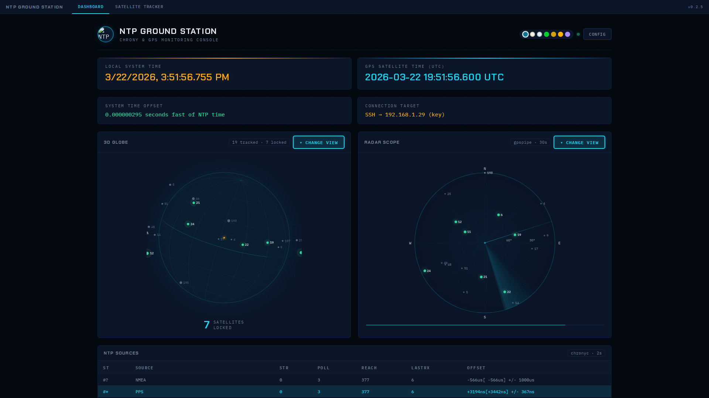

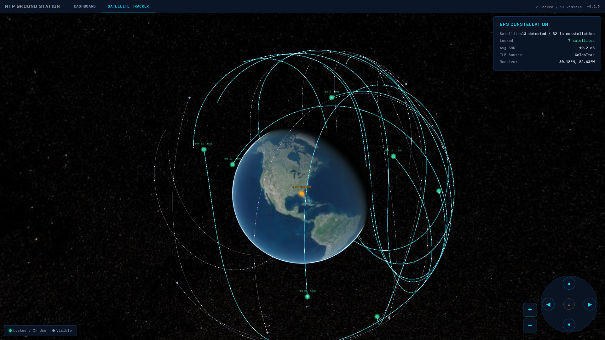

### Themes

| Ground Station | Phosphor | Deep Space |
|---|---|---|
| 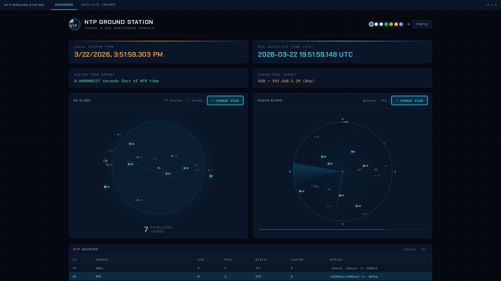 | 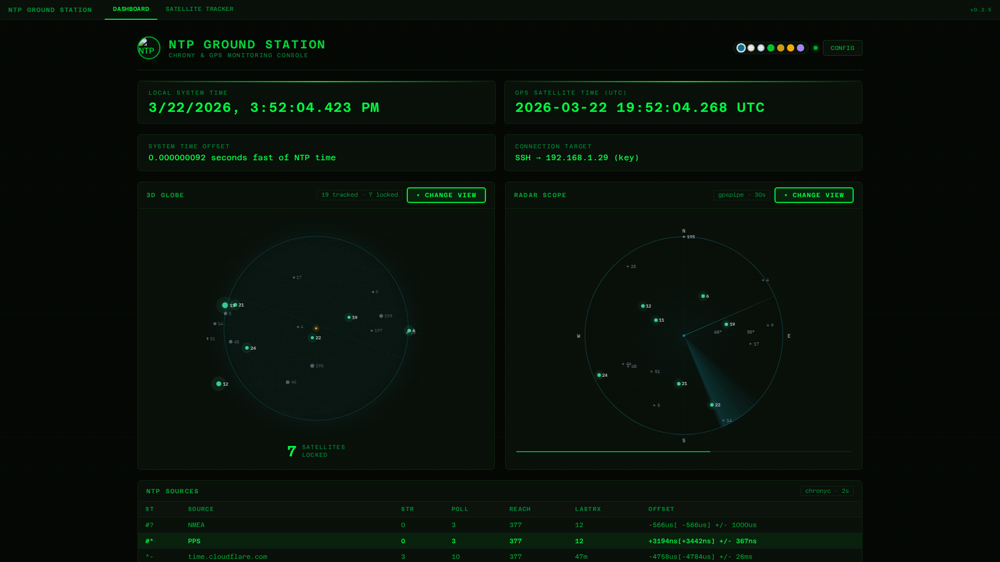 | 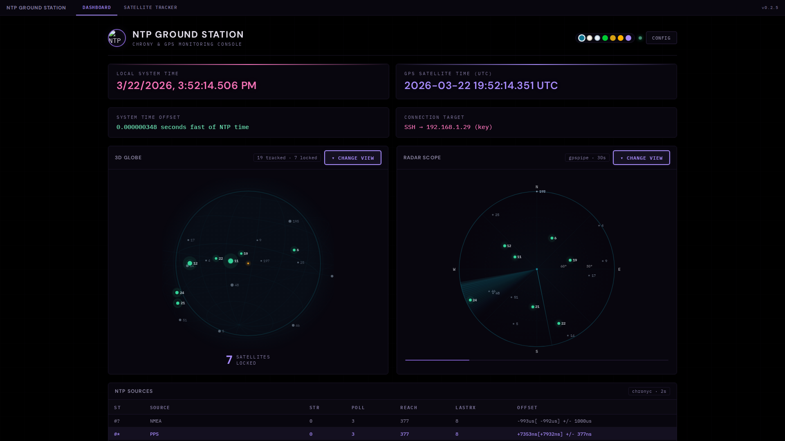 |

| Daylight | Solar | Arctic | Amber Terminal |
|---|---|---|---|
| 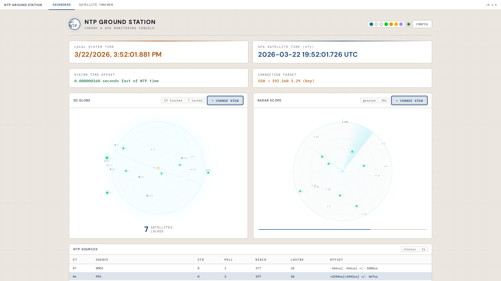 | 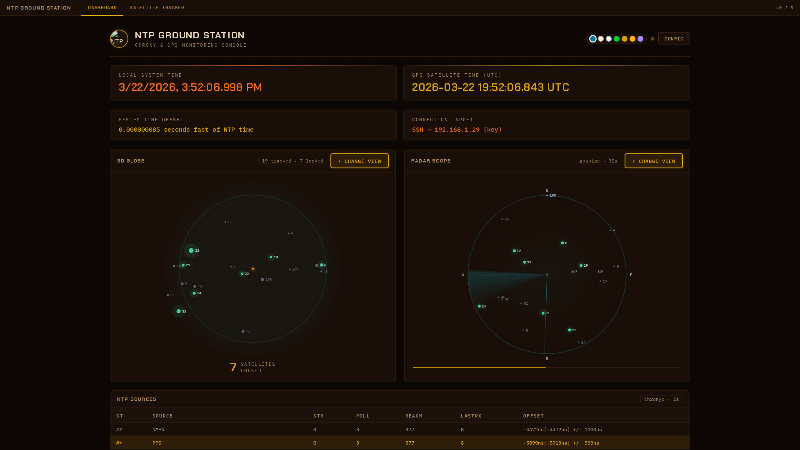 | 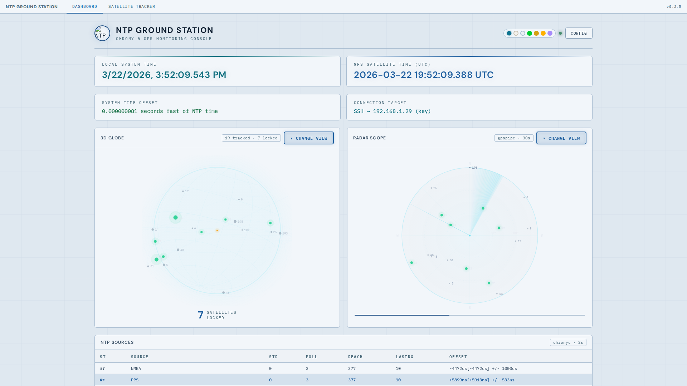 | 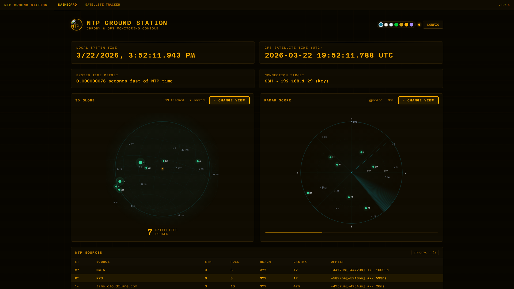 |

### Visualizations

| Signal Skyline | Chrony Dashboard | Planet Earth |
|---|---|---|
| 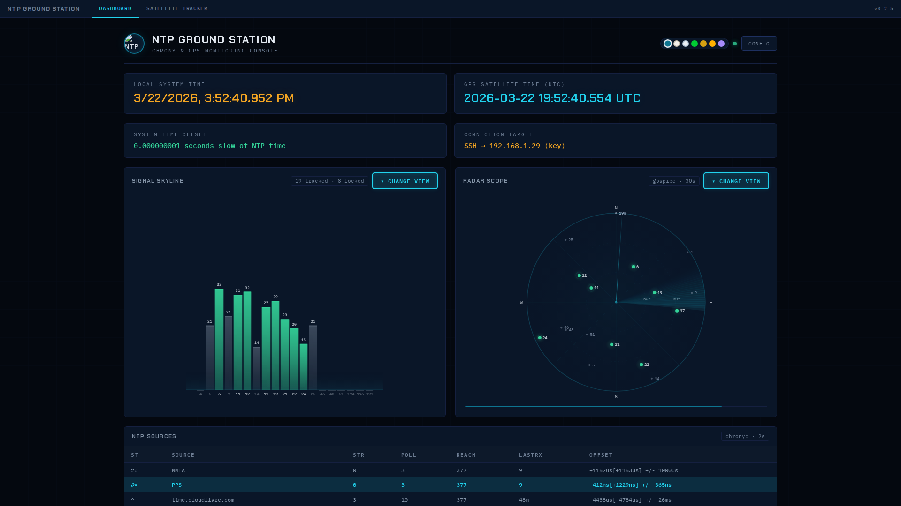 | 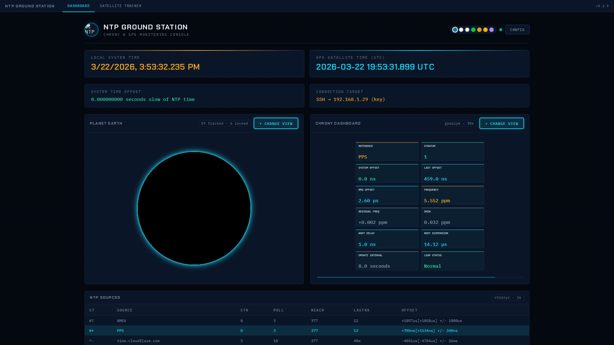 | 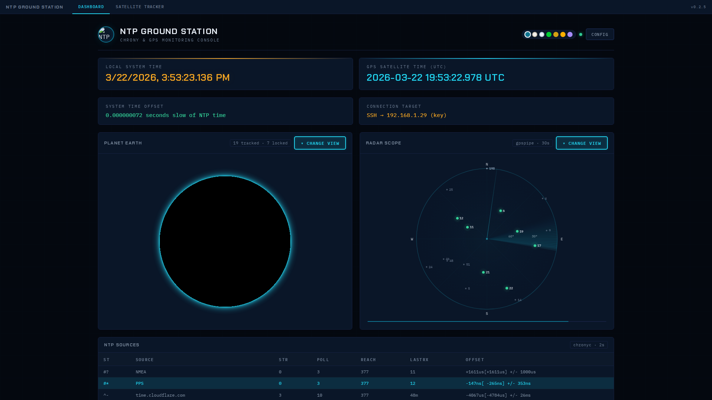 |

| Offset Timeline | Reach Pattern | Stratum Tree |
|---|---|---|
| 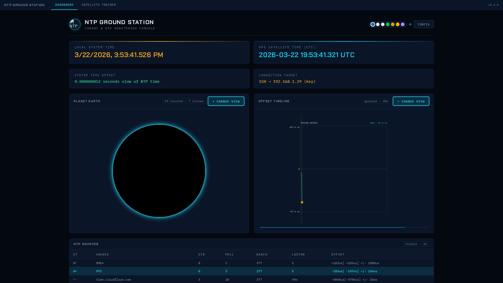 | 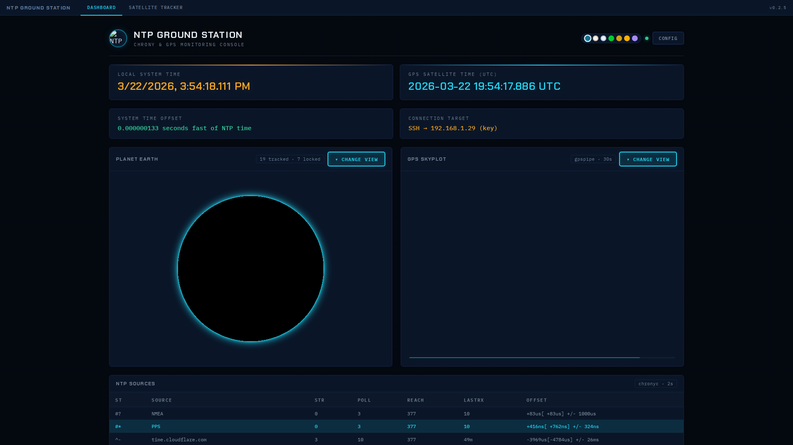 | 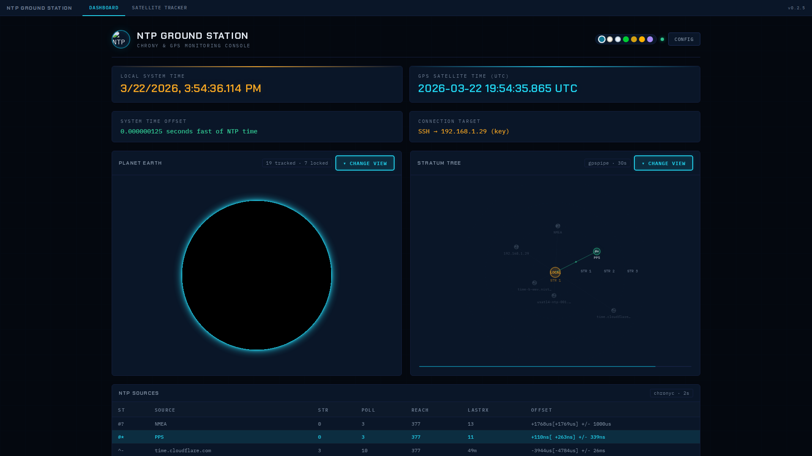 |

---

## Image Variants

| Tag | Size | Description |
|-----|------|-------------|
| `ghcr.io/danktankk/chronolens:latest` | ~100MB | **Slim.** Remote-only — connects to your NTP/GPS host via SSH. This is what you want. |
| `ghcr.io/danktankk/chronolens:0.2.5-local` | ~1.4GB | **Full.** Includes chrony + gpsd-clients inside the container for local mode. |

**What does "local" mean?** It does NOT mean "running at home" or "on your LAN." It means chrony and gpsd are running *inside the same Docker container* as the web dashboard — i.e., you have a GPS receiver plugged directly into the machine running the container and chrony/gpsd configured there. If you monitor a separate NTP server over SSH (which is almost certainly your setup), use the slim image.

---

## Features

### Main Dashboard (`/`)
- **16 visualization modes** across two side-by-side canvas panels with a modal picker
- **7 GPS visualizations** — 3D wireframe globe, polar radar scope, signal skyline (SNR bars), polar heatmap, constellation web, horizon sweep, signal radar (spider chart)
- **8 NTP/chrony visualizations** — drift timeline, chrony dashboard (12-metric grid), source offset comparison, frequency drift, source jitter, reach pattern, root metrics, stratum tree
- **COBE planet Earth** — WebGL globe with theme-aware colors and real satellite markers
- **7 themes** — Ground Station, Daylight, Phosphor, Solar, Arctic, Amber Terminal, Deep Space
- **Auto-cycle** — rotates through visualizations with smooth fade transitions
- **Live data** — chrony tracking/sources/sourcestats polled every 2s, GPS via gpspipe every 30s
- **Settings modal** — configure target host, SSH auth, Cesium token, receiver coordinates
- **WCAG accessible** — all themes pass 4.5:1 contrast ratio, minimum 0.7rem CSS / 9px canvas fonts
- **Canvas fade-in** — visualizations sync with page entrance animations

### Satellite Tracker (`/satellite`)
- **CesiumJS 3D globe** — photorealistic Earth with terrain, atmosphere, and day/night lighting
- **Real GPS constellation** — all operational GPS satellites plotted from CelesTrak TLE data
- **Live receiver overlay** — satellites your receiver can see are highlighted, locked sats glow green
- **Orbital paths** — 12-hour predicted orbit lines for visible satellites
- **Navigation disk** — on-screen D-pad for pan/zoom/home (hold to continuous move, touch support)
- **Mobile ready** — full Android/iPhone support with dvh units, touch gestures, responsive layout, collapsible info panel
- **Street-level zoom** — zoom from orbital view all the way down to individual buildings
- **Self-hosted assets** — CesiumJS and satellite.js bundled in the Docker image (no CDN dependency at runtime)

### Multi-Architecture
- Images built for both **linux/amd64** and **linux/arm64** (Raspberry Pi, Apple Silicon, etc.)

---

## Quick Start

### 1. Create a directory and compose file

```bash
mkdir chronolens && cd chronolens
```

Create `compose.yaml`:

```yaml
services:
  chronolens:
    image: ghcr.io/danktankk/chronolens:latest
    container_name: chronolens
    ports:
      - "55234:55234"
    volumes:
      - ./data:/app/data
      - ./ssh:/app/ssh:ro
    restart: unless-stopped
```

### 2. Add your SSH key

Place your private key (for connecting to the chrony/gpsd host) in the `ssh/` directory:

```bash
mkdir -p ssh
cp ~/.ssh/id_ed25519 ssh/
chmod 600 ssh/id_ed25519
```

### 3. (Optional) Set Cesium token for satellite tracker

The satellite tracker requires a free [Cesium Ion](https://ion.cesium.com/) access token. You can set it via environment variable or through the Settings modal in the UI.

**Option A — Environment variable:**

Add to `compose.yaml` under the service:

```yaml
environment:
  - CESIUM_TOKEN=your_token_here
```

**Option B — Settings modal:**

Launch the dashboard, click the gear icon, and paste your token in the Cesium Ion Access Token field. It will be encrypted and stored in `data/config.json`.

To get a token:
1. Create a free account at [cesium.com/ion](https://cesium.com/ion/)
2. Go to **Access Tokens** in your dashboard
3. Copy the **Default Token** (or create a new one)

### 4. Start

```bash
docker compose up -d
```

Dashboard will be available at `http://<your-host>:55234`

---

## Configuration

On first launch, open the **Settings** modal (gear icon on the dashboard) to configure:

| Setting | Description |
|---|---|
| **SSH Host** | IP or hostname of the chrony/gpsd server |
| **SSH User** | Username for SSH connection |
| **Auth Method** | `SSH Key` (mounted in `ssh/`) or `Password` |
| **Cesium Token** | Cesium Ion access token for the satellite tracker |
| **Receiver Lat/Lon** | GPS receiver coordinates (auto-detected from gpsd if available) |

All settings are encrypted and persisted in `data/config.json`.

---

## Using the Dashboard

### Visualization Panels

The two canvas panels on the main dashboard each show one visualization. Click **CHANGE VIEW** on either panel to open the picker.

**GPS visualizations** use data from `gpspipe` — satellite positions, signal strength, lock status. These update every 30 seconds.

**NTP visualizations** use data from `chronyc` — system offset, frequency drift, source statistics, stratum info. These update every 2 seconds.

**Themes** can be switched using the color swatches in the top bar. All visualizations and the COBE planet globe adapt to the selected theme.

### Satellite Tracker

Navigate to the **Satellite Tracker** tab or visit `/satellite` directly.

**Desktop controls:**
- Left-drag to rotate the globe
- Scroll to zoom
- Right-drag to tilt
- Click any satellite for details

**Mobile controls:**
- One-finger drag to rotate
- Pinch to zoom
- Two-finger drag to tilt
- Tap a satellite for details

**Navigation disk (bottom-right):**
- Arrow buttons — pan (hold to keep moving)
- `+` / `-` — zoom in/out
- Center button — fly home to receiver

**What the colors mean:**
- **Green** — satellite locked, actively used for timing
- **Grey** — satellite visible to receiver but not in use
- **Dark** — satellite in constellation but below horizon
- **Amber dot with ring** — your GPS receiver location

---

## Architecture

```
Browser ──────► Flask (port 55234)
                  │
                  ├── / ──────────► index.html + dashboard.js + visualizations.js
                  ├── /satellite ──► satellite.html (CesiumJS + satellite.js)
                  ├── /api/ntp ───► SSH → chronyc tracking/sources/sourcestats
                  ├── /api/gps ───► SSH → gpspipe -w -n 12
                  └── /api/config ► data/config.json (encrypted)
```

- **Frontend**: Vanilla JS, no framework. Canvas-based visualizations via `VizEngine` IIFE module.
- **Backend**: Flask + Paramiko (SSH). Polls remote chrony/gpsd host.
- **CesiumJS**: Self-hosted in Docker image (~5MB JS). Satellite positions computed client-side from TLE data using satellite.js.
- **Data persistence**: `data/` volume stores encrypted config and encryption key.
- **Multi-stage build**: Slim image uses a builder stage for asset downloads (Cesium, satellite.js, Tailwind), keeping the final image free of wget/unzip tooling.

---

## Docker Volumes

| Path | Purpose |
|---|---|
| `./data:/app/data` | Config file + encryption key (persisted across rebuilds) |
| `./ssh:/app/ssh:ro` | SSH private key for remote chrony/gpsd host |

---

## Requirements

- Docker + Docker Compose
- A chrony + gpsd host accessible via SSH
- A browser with WebGL support (any modern browser)
- (Optional) Free Cesium Ion account for satellite tracker

---

## Version History

| Version | Changes |
|---------|---------|
| **0.2.5** | Multi-stage slim Dockerfile (~100MB), multi-arch (amd64/arm64), local mode split to separate image variant |
| **0.2.4** | Code review cleanup — fixed stale version display, collapsed theme hierarchy, duplicate style tags, unused params, DRY refactors |
| **0.2.3** | Full readability overhaul — all themes pass WCAG 4.5:1, min font sizes enforced, alpha floors raised |
| **0.2.0** | Self-hosted CesiumJS + satellite.js, navigation disk with touch support, full mobile support |

---

## License

MIT
